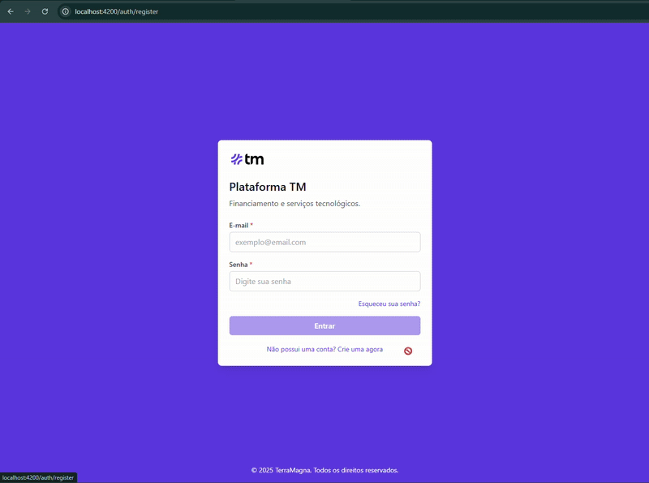

# tmdigital case

<a alt="Terra Magna Logo" href="https://terramagna.com.br" target="_blank" rel="noreferrer"></a>

## Figma

Esse é um case baseado no seguinte Figma:
https://www.figma.com/design/AMAxQLWrxIotqB8NVkgGdB/tmdigital?node-id=0-1&t=UeBctpz8alWA32nb-1

## Requisitos

- É necessário ter o Node.js instalado, preferencialmente a versão 20+.
- É necessário ter o Nx instalado, preferencialmente a versão 10+.

## Stack e Arquitetura

- Nx
- Angular 19
- Tailwind CSS
- NestJS
- TypeScript

Como metodologia arquitetural, foi utilizado o padrão [Feature Sliced Design](https://feature-sliced.design/) (obs: ainda estou experimentando o padrão).

## Executando o projeto

Para executar o projeto, rode o seguinte comando:

```sh
npx nx serve tm
```

O front-end será executado na porta 4200.

API ainda em construção. O front-end está funcionando com mock de dados.

## Demonstração



Vídeo completo: https://drive.google.com/file/d/1njS6VXZ2XQkideB7Hmm7BqI0RqRIPBqi/view?usp=sharing

## A fazer

- [x] Setup do projeto com Nx e dependências (Tailwind, Lucide, etc)
- [x] Criar tela de login
- [x] Criar tela de cadastro
- [x] Criar tela de onboarding
- [x] Criar tela de análise de crédito
- [x] Navegação entre as telas
- [x] Fluxo funcional persistindo dados do localStorage
- [x] Criar guard de autenticação
- [x] Testes para os componentes de autenticação
- [ ] Testes para os componentes shared, onboarding e análise de crédito
- [ ] Criar API (POST /user, POST /login, POST /farms, GET /credit-analysis, POST /analysis)
- [ ] Autenticação com JWT
- [ ] Criar testes da API
- [ ] Atualizar serviços do Front-end de acordo com a API
- [ ] Criar testes do Front-end para os serviços atualizados
